**The only numbers used in the computations are daily reported cases (and for the case of Slovenia also the daily number of tests performed).** No other information of any kind, however relevant, is used. No estimates, assumptions, simulations, comparisons with other outbreaks etc for any epidemiological parameters are accounted for, let alone the changing effects of countermeasures or other dynamic factors.

For each forecast only data from the past 3 weeks is used. The assumption that after three weeks people are no longer spread the virus so older data can be discarded.

The the theory used to obtain these estimates is explained under [Theory](theory.md).

### Slovenia

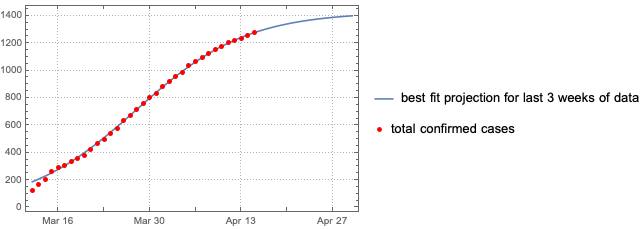

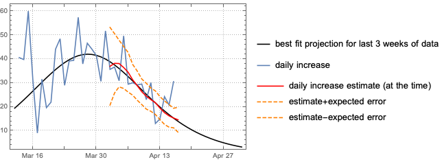

 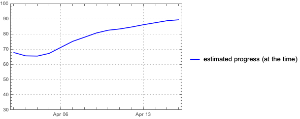

### Italy

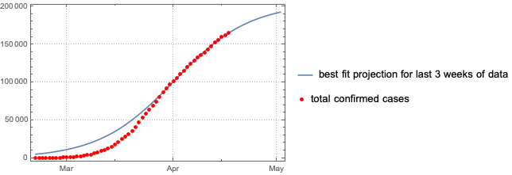

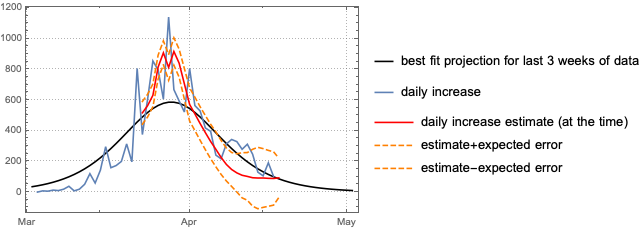

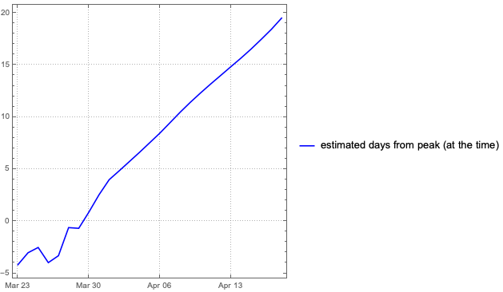

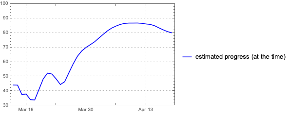

### Austria

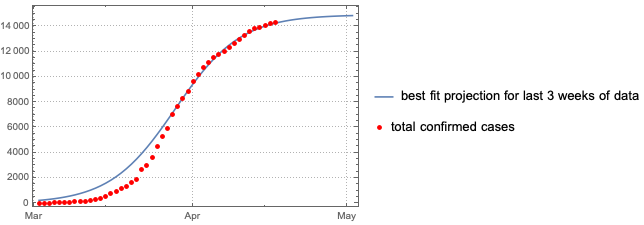

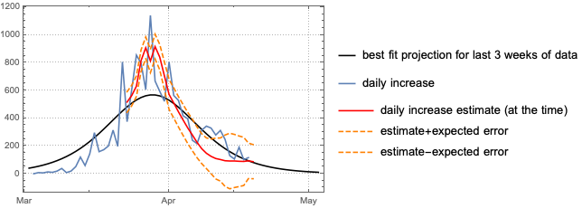

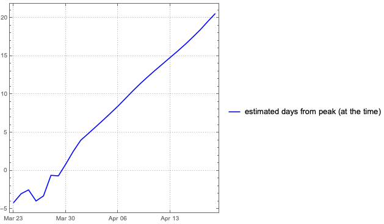

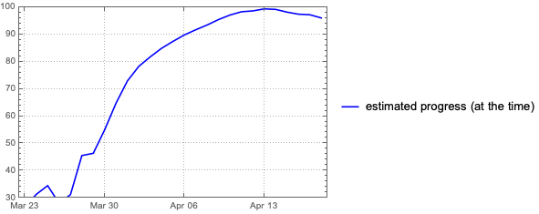

### Germany

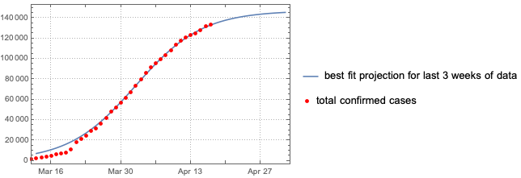

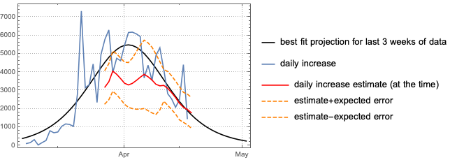

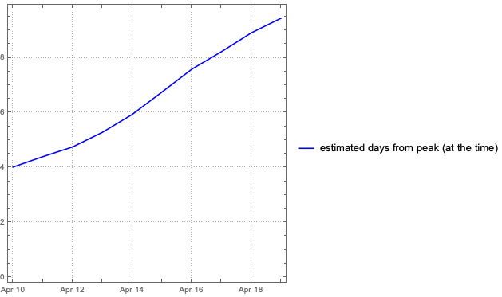

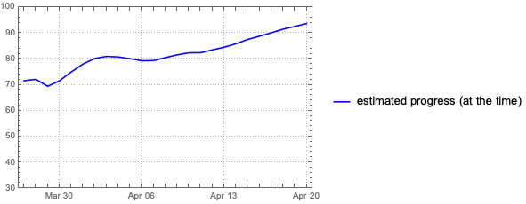
