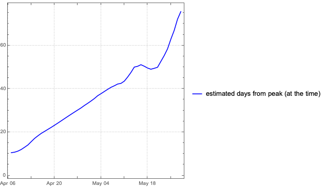
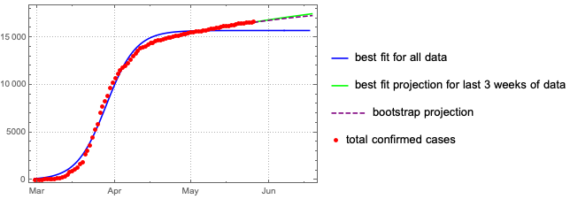
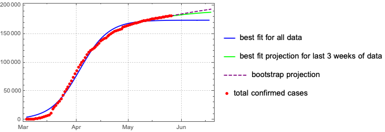
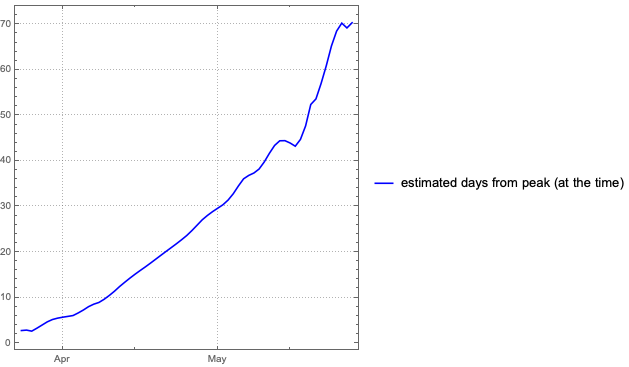
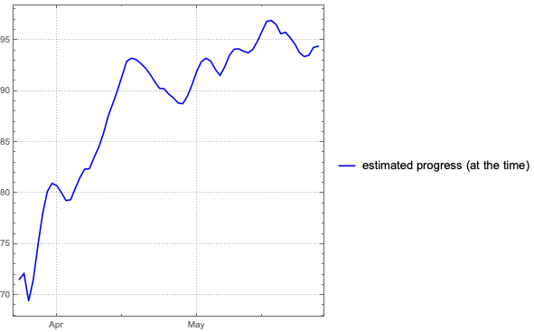

## Coronavirus forecasts

**The only numbers used in the following computations are daily reported cases (and for the case of Slovenia also the daily number of tests performed).** No other information of any kind, however relevant, is used. No estimates, assumptions, simulations, comparisons with other outbreaks etc for any epidemiological parameters are accounted for, let alone the changing effects of countermeasures or other dynamic factors.

These are therefore **not** scientific forecasts since we are not pretending we know of any credible way of estimating the relevant parameters, and should be viewed simply as projections based only on the available (very) imperfect data.

For each forecast only data from the past 3 weeks is used. The assumption here is that after three weeks people are no longer infectious so older data can be discarded.

The basic the theory used to obtain these estimates is explained under [theory](theory.md).

### Slovenia

The following graph shows the current (as of ****) best fit for total number of cases. For the case of Slovenia the numbers of daily confirmed cases are normalised with respect to number of daily tests, so these are not the raw daily numbers. As a result the fit has been tighter and estimates have been more accurate than for other countries. 

This plot shows the daily increases and daily increase estimates (together with rough expected error estimates) and the current projected curve.

The next graph shows the estimated number of days since the peak of the outbreak, computed on the given date. If the projection is stable, the estimated distance from the peak should progress by 1 for each day that passes.

 

The last plot shows the estimate of the percentage of people that have already been infected relative to the total number of people that are projected to be infected during the current outbreak. Again, the estimates are based on the numbers that were available at the date. 

### Italy

The current (as of ****) best 3-week data fit for Italy.

 

The large error estimates of late mean the new numbers are deviating from the current computed projection. This could indicate an actual change of dynamic of the epidemic or a change in the testing regime.

### Austria

The current (as of **April 17**) best 3-week data fit for Austria.

After a period of fairly stable projections for Austria, the error estimates increased considerably in the second week of April when the numbers began overshooting the projection by much more than expected. Consequently, the projection is unreliable for now.

### Germany

The current (as of **April 17**) best 3-week data fit for Germany.

