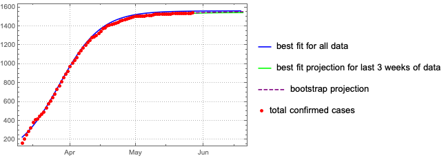
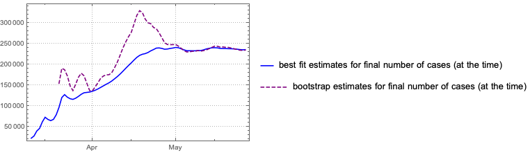
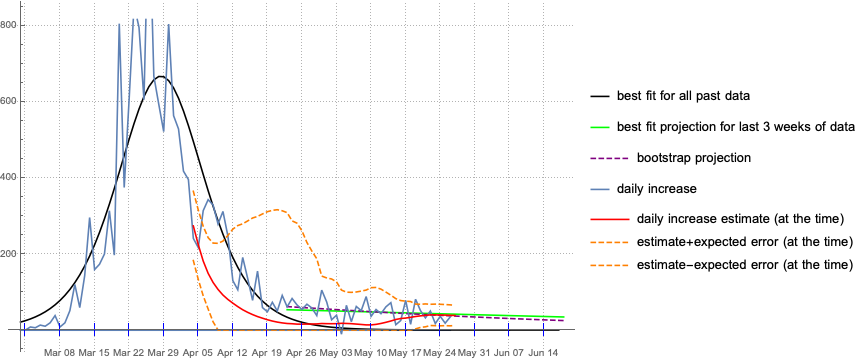
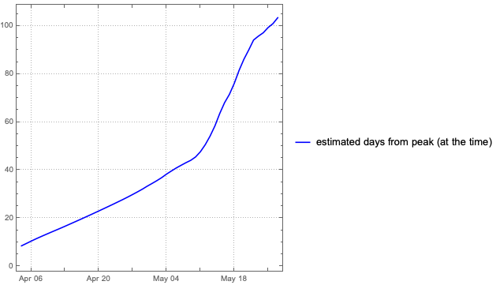
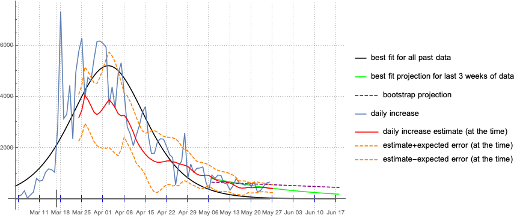
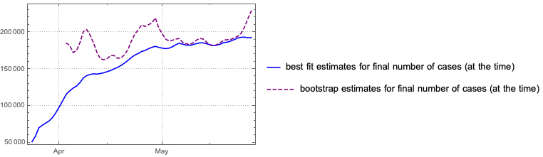
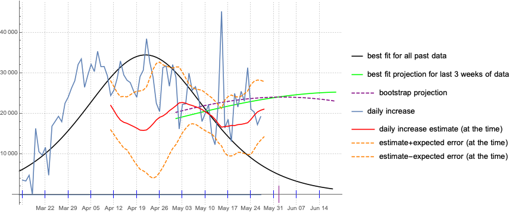
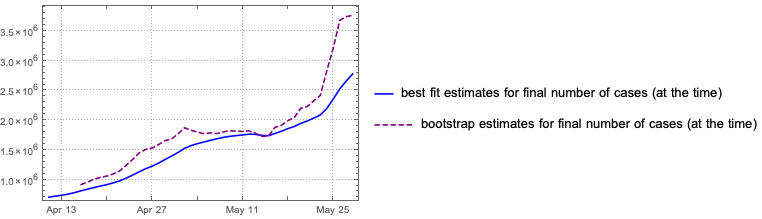

## Coronavirus projections

**The only numbers used in the following computations are daily reported cases (and for the case of Slovenia also the daily number of tests performed).** No other information of any kind, however relevant, is used. No estimates, assumptions, simulations, comparisons with other outbreaks etc for any epidemiological parameters are accounted for, let alone the changing effects of countermeasures or other dynamic factors.

These are therefore **not** scientific forecasts since we are not pretending we know of any credible way of estimating all the relevant parameters, and should be viewed simply as projections based only on available imperfect and often unreliable data.

For each forecast only data from the past 3 weeks is used. The assumption here is that after three weeks people are no longer infectious so older data can be discarded.

The basic the theory used to obtain these estimates is explained under [theory](theory.md). 

### Slovenia

The following graph shows the current (as of ****) best fit for total number of cases. For the case of Slovenia the numbers of daily confirmed cases are normalised with respect to number of daily tests, so these are not the raw daily numbers. As a result the fit has been tighter and estimates have been more accurate than for other countries. 

This plot shows the daily increases and daily increase estimates (together with rough expected error estimates) and the current projected curve. For most countries, the best fit estimate shows a bias for smaller than actual daily increases. In order to correct this we also include a 'boostrap' estimate which at least partially compensates for the bias in the errors. For Slovenia this bootstrap projection differs only slightly from the best fit projection. This means that on average the best fit has been a been a good estimate the number of daily cases, at least for the time being.

The next graph shows the estimated number of days since the peak of the outbreak, computed on the given date. If the projection is stable, the estimated distance from the peak should progress by 1 for each day that passes.

 

The last plot shows how the estimates for the total number of cases that will occur during the outbreak have changed with time. As we see, for Slovenia both projections have not changed much for a while. 

### Italy

The current (as of ****) best 3-week data fit for Italy.

 

The large error estimates mean the new numbers are deviating from the current computed projection. This could indicate an actual change of dynamic of the epidemic or simply changes in the testing regime.

Both estimates for the final number of cases for Italy have consistentently risen throughout the epidemic but the bias in the best fit projection has recently begun to fall.

### Austria

The current (as of ****) best 3-week data fit for Austria.

After a period of fairly stable projections for Austria, the error estimates increased considerably in the second week of April when the numbers began overshooting the projection by much more than expected.

### Germany

The current (as of ****) best 3-week data fit for Germany.

As in the case for Italy, the best fit estimate for the total number of cases has risen through time, but the bootstrap estimate has been reasonably consistent.

### USA

The current (as of ****) best 3-week data fit for America.
The best fit and bootstrap projections differ significantly and both estimates for the USA are still rising quickly (see below). This would suggest an unstable situation. It is not even certain that the peak is actually over. The large error estimates also imply that obtaining reliable estimates for the final outcome using just available data is difficult at the moment.

