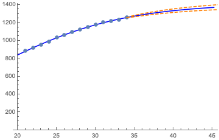
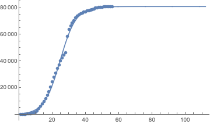

A basic model for the cumulative number of cases in an epidemic is the logistic curve, which can be written as

$$
f(x)=\frac{ab}{(a−b)e^{−cx}+b}
$$

Of particular interest is the parameter a since

$$
\lim_{x\to\infty}f(x)=a
$$

as you can easily verify. Another important value is the peak of the derivative f′(x) which corresponds to the maximum number of new cases in one day during the outbreak. You can find the expressions for the maximum of f′(x) and corresponding x yourself (another way of calling this point is the inflection point).

The parameter c is both the growth rate in the early stages and also the 'slow down' rate nearing the end. (This will be obvious once we get to differential equations.) The parameter b is simply the initial value f(0). 

Our goal is to find the logistic curve which gives the best fit for a sequence of data points xi. As in the familiar linear setting, the idea is to minimise the sum-of-squares criterion function

$$
g(a,b,c)=\sum_if((x_i;a,b,c)−x_i)^2
$$

We are viewing g as a function of the uknown parameters (a,b,c) since the data xi is given. Because f is nonlinear in a,b,c, the derivative of g is also nonlinear, so the minimum cannot be found by solving a linear system of equations (using normal systems, pseudoinverses etc). But it can be done in a variety of other ways. The results below are computed using the Gauss-Newton method. Of course the minimum does not depend on the method used, although how easy it is to find the minimum may.
[link na stran](test.md)

