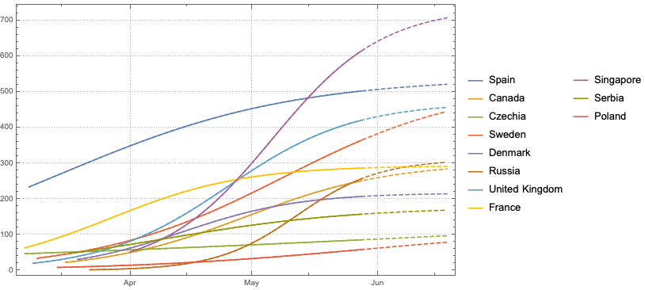
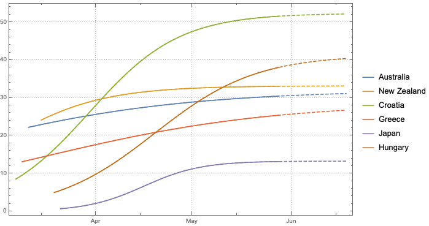

#### More selected countries 

Some countries with more than 100 cases per 100k of population

Some countries with less than 100 cases per 100k 

A list of countries for which the projections are available:
* [Spain](countries/spain.md)
* [Canada](countries/canada.md)
* [Australia](countries/australia.md)
* [New Zealand](countries/newzealand.md)
* [Croatia](countries/croatia.md)
* [Czech Republic](countries/czechia.md)
* [Sweden](countries/sweden.md)
* [Greece](countries/greece.md)
* [Japan](countries/japan.md)
* [Spain](countries/spain.md)
* [Denmark](countries/denmark.md)
* [Russia](countries/russia.md)
* [UK](countries/uk.md)
* [Hungary](countries/hungary.md)
* [France](countries/france.md)
* [Singapore](countries/singapore.md)